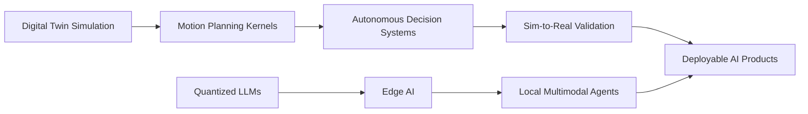



  
  
  

---

## Executive Snapshot

<table>
<tr>
<td width="55%" valign="top">

I build intelligent systems where **AI, simulation, autonomous decision-making, and product engineering** meet. My work focuses on turning complex ideas into practical systems: digital twins, motion planners, explainable AI pipelines, multi-modal assistants, and data-driven products that feel reliable in the real world.

- **KPIT Sparkle 2026 Finalist** from 18k+ participants.
- Building across **Digital Twin Systems**, **Autonomous Motion Planning**, **Generative AI**, and **Applied Data Science**.
- Strong interest in **sim-to-real validation**, **agentic systems**, **edge AI**, and **high-impact AI products**.
- Comfortable moving from research logic to deployable software.

</td>
<td width="45%" align="center" valign="top">

</td>
</tr>
</table>

---

## Signature Projects

<table>
<tr>
<td width="50%" valign="top">

### Digital Twin Motion Planner
Real-time trajectory planning system for autonomous vehicles with simulation-backed validation and optimization.

`Python` `Simulation` `Autonomous Vehicles` `Motion Planning`

</td>
<td width="50%" valign="top">

### Chess AI Agent
AlphaZero-inspired chess intelligence using ResNet policy-value learning and MCTS-based decision search.

`PyTorch` `MCTS` `FastAPI` `Reinforcement Learning`

</td>
</tr>
<tr>
<td width="50%" valign="top">

### Skin Diagnosis with XAI
Deep learning pathology detection pipeline with explainability layers for transparent model interpretation.

`TensorFlow` `Computer Vision` `Explainable AI` `Healthcare AI`

</td>
<td width="50%" valign="top">

### ORION Multi-Modal Assistant
Context-aware assistant with memory, automation hooks, and multi-channel API integration.

`Python` `LLM` `Memory Systems` `Automation`

</td>
</tr>
<tr>
<td width="50%" valign="top">

### Unora Music App
Privacy-first music assistant powered by local AI for recommendation, playback, and personalized controls.

`Flutter` `Ollama` `Mistral` `Local AI`

</td>
<td width="50%" valign="top">

### AtmosphereX
Predictive route intelligence and travel insight platform using optimized data science workflows.

`Data Science` `Route Planning` `Prediction` `Analytics`

</td>
</tr>
</table>

---

## Tech Arsenal

### Languages

### AI, Data, and Backend

### Tools and Platforms

---

## Engineering Domains

<table align="center">
<tr>
<td align="center" width="25%">

  
Simulation-backed systems for motion, planning, and validation.
</td>
<td align="center" width="25%">

  
Decision systems for agents, vehicles, and robotics workflows.
</td>
<td align="center" width="25%">

  
LLM products, assistants, automation, and multi-modal interfaces.
</td>
<td align="center" width="25%">

  
Predictive modeling, analytics, dashboards, and decision intelligence.
</td>
</tr>
</table>

---

## Live Metrics

---

## Research Pipeline

- **Autonomous Swarms:** multi-agent coordination for warehouse and logistics environments.
- **Sim-to-Real Systems:** reducing the reality gap in high-speed autonomous motion planning.
- **Quantized LLMs:** deploying lightweight vision-language models for local robotics and edge intelligence.

---

## Contribution Graph

---

## Collaboration Signal

**Open to AI, autonomous systems, applied research, data science products, and ambitious engineering collaborations.**

 

